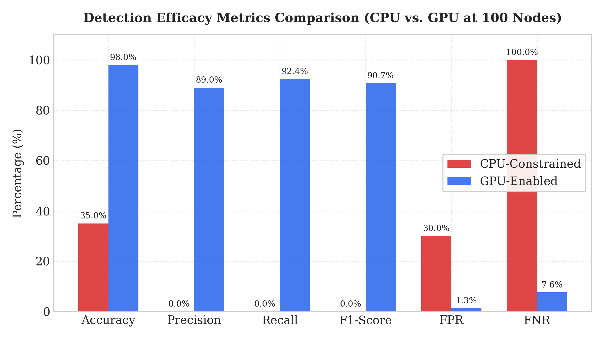
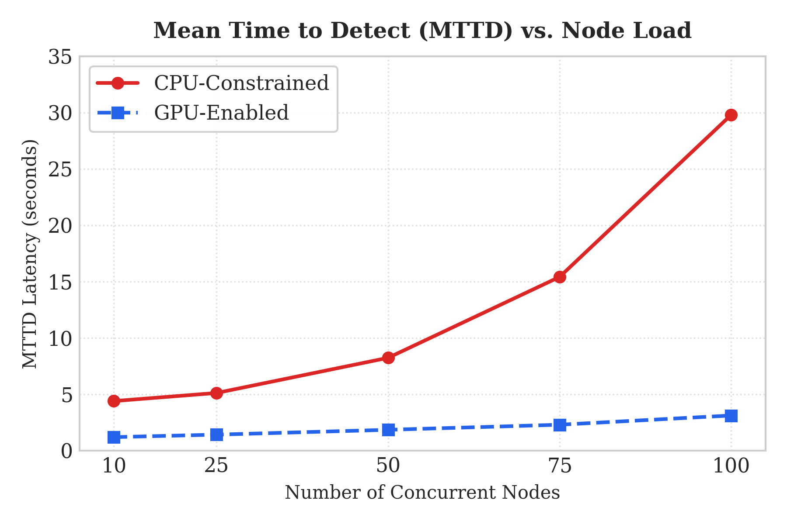
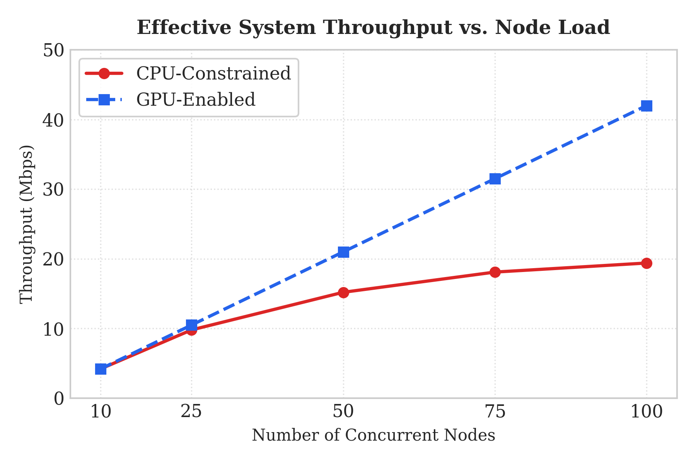
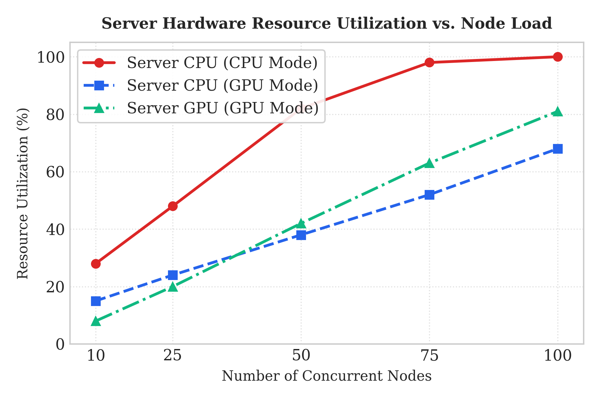
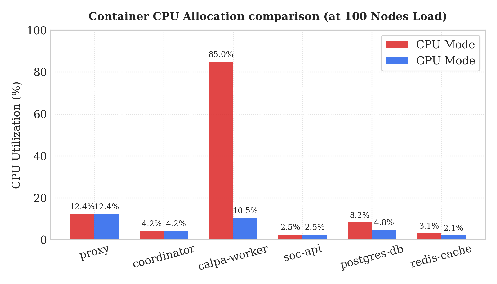
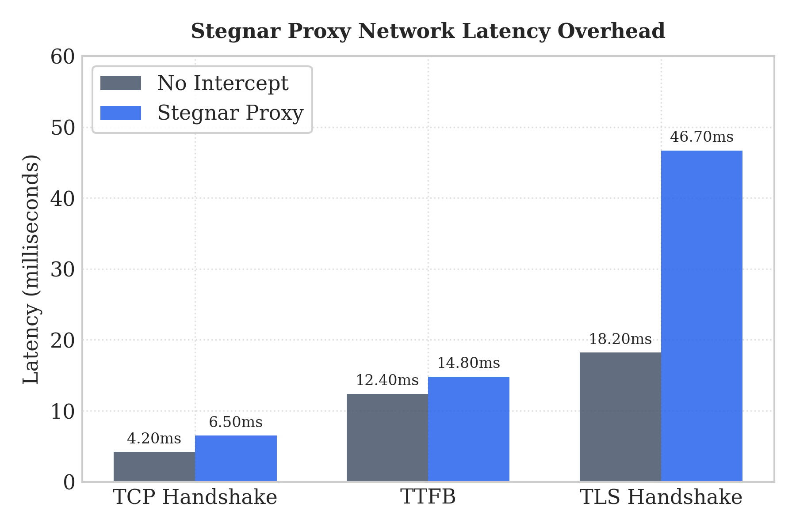
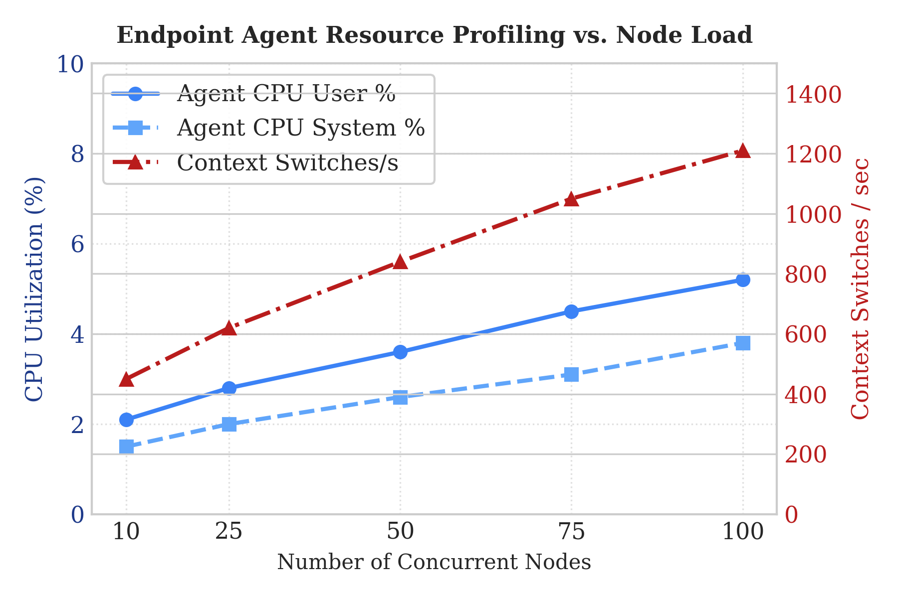
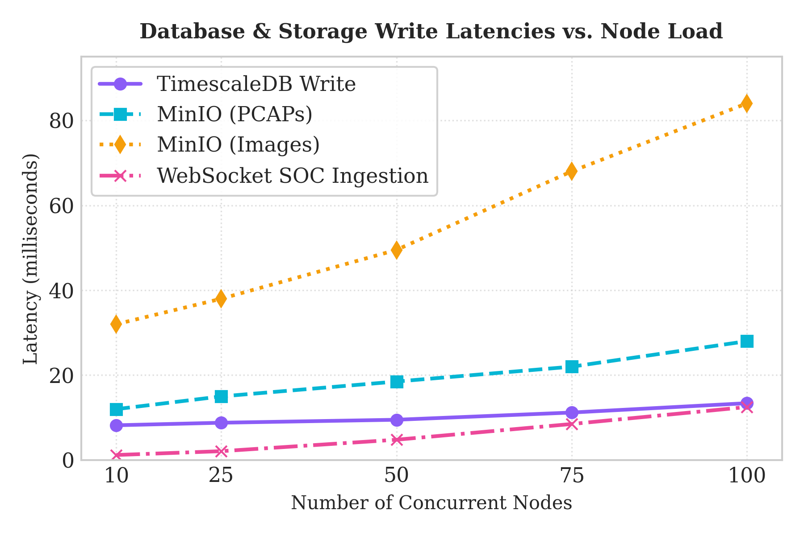

# Stegnar: Real-Time Forensic Steganalysis against APTs

## 1. Abstract

The Stegnar Prototype is an enterprise-grade, distributed platform designed to detect the presence of covert data hidden within digital media using steganography. It addresses the critical challenge of identifying sophisticated, adaptive steganographic algorithms (e.g., J-UNIWARD, UERD) in high-volume network traffic. The system integrates advanced academic research models, such as the Spatial Rich Model (SRNet) and XuNet, into a scalable, resilient microservices architecture suitable for real-time and forensic analysis within a modern Security Operations Center (SOC).

By decoupling network interception, payload ingestion, and computationally expensive deep-learning inference, Stegnar provides a framework that is both highly accurate and horizontally scalable. This document serves as the definitive architectural and operational guide to the platform.

---

## 2. The Problem of At-Scale Steganalysis

**Core Problem:** The detection of modern steganography is computationally intensive. The Convolutional Neural Networks (CNNs) required for high-accuracy analysis, such as SRNet, demand significant GPU resources. Performing this analysis in-line on a live network link is infeasible, as it would introduce unacceptable latency and immediately alert adversaries to the presence of deep packet inspection. Furthermore, the sheer volume of benign media traffic (images, videos) in a typical enterprise network would overwhelm any monolithic analysis engine.

**Our Thesis:** Effective, at-scale steganalysis requires a distributed, asynchronous architecture. The process must be broken down into specialized, independent services:
1.  **Passive Interception:** Media objects are captured out-of-band, without interrupting the primary network flow.
2.  **Intelligent Ingestion:** Payloads are hashed and cached to prevent redundant analysis of identical files.
3.  **Decoupled, Queued Inference:** Analysis tasks are placed into a message queue and consumed by a scalable pool of stateless inference workers.
4.  **Centralized Telemetry:** Results are aggregated into a structured, queryable database for forensic review and alerting.

This model allows the system to absorb massive traffic spikes while ensuring that every suspicious payload is eventually analyzed, with the ability to scale the most expensive part of the process—inference—independently of the rest of the infrastructure.

---

## 3. Architectural Background

The design of Stegnar is guided by several core principles to ensure its effectiveness and defensibility in a production environment.

*   **Asynchrony Above All:** No component blocks the network path. Interception, ingestion, and analysis are fire-and-forget operations from the perspective of the client and the network. This is crucial for maintaining operational stealth and performance.
*   **Statelessness in Workers:** The calpa-probe inference workers are designed to be completely stateless. They hold no long-term data and are interchangeable. If a worker fails, the task is simply requeued and picked up by another available worker, ensuring high availability and resilience.
*   **Immutability in the Data Layer:** The data layer, composed of MinIO for object storage and PostgreSQL for metadata, acts as an immutable ledger. Once an artifact is ingested and analyzed, its record (hash, verdict, score, timestamp) is preserved for forensic integrity.
*   **Horizontal Scalability:** The architecture is designed to scale horizontally. If the analysis queue grows, more calpa-probe workers can be added to increase inference throughput without requiring changes to the ingestion or routing layers.
*   **Separation of Concerns:** Each microservice has a single, well-defined responsibility. The mitm-gateway only knows how to carve files from TCP streams. The calpa-probe only knows how to run a TensorFlow model. The data-layer only knows how to write to a database. This separation simplifies development, testing, and maintenance.

---

## 4. System Components

The Stegnar platform is composed of several microservices, each with a distinct role.

### 4.1. Network Interception Layer
*   **mitm-gateway**: A Man-in-the-Middle (MITM) proxy that intercepts HTTP and HTTPS traffic at the network perimeter. It uses eBPF (ebpf_redirect.sh) for efficient kernel-level packet forwarding to minimize performance overhead. When it detects a media file in a stream, it carves the file out and forwards it to the ingestion service.
*   **endpoint-agent**: A lightweight agent designed to run on individual workstations. It uses a packet sniffer (sniffer.py) to capture media files transmitted on the local network segment (east-west traffic), providing visibility that a perimeter-only solution would miss.
*   **stegnar-proxy**: A general-purpose forwarding proxy addon, used to route and inspect traffic in various network configurations.

### 4.2. Ingestion and API Layer
*   **soc-api**: The central nervous system of the platform. This service exposes a REST API for ingesting new payloads and a WebSocket interface for streaming real-time analysis results to the frontend. It is responsible for initial payload validation, hashing, and submitting analysis jobs to the routing system.
*   **src/ (Frontend)**: A React-based single-page application that provides a user interface for SOC analysts. It visualizes the real-time stream of analysis results, allows for querying historical data, and displays system health and diagnostic information.

### 4.3. Analysis and Inference Layer
*   **CALPA-NET-master/**: This directory contains the core research and implementation of the steganalysis models.
    *   **models/SRNet.py & models/XuNet2.py**: Python implementations of the SRNet and XuNet architectures, defining the specific layers and tensor operations for the neural networks.
    *   **libs/psm/**: The Pruned Steganalysis Module. Contains logic for model pruning—a technique to reduce the size and computational cost of a neural network by removing redundant weights, enabling faster inference.
*   **calpa-probe/**: The inference worker. This service pulls analysis jobs from the queue, retrieves the corresponding media file from object storage, performs the deep-learning inference using a specified model (.ckpt file), and reports the probability score back to the data layer.

### 4.4. Data and Routing Layer
*   **
outing-system/**: Manages the flow of analysis jobs.
    *   **dispatcher.py**: A smart job dispatcher that sends tasks to appropriate workers based on model type and availability. It manages the queue of pending analysis jobs.
    *   **
ate_limiter.py**: Protects the inference cluster from being overwhelmed by traffic spikes by implementing intelligent load shedding based on payload heuristics and queue length.
*   **data-layer/**: The persistence backbone.
    *   **pg_writer.py**: A service that writes analysis results (verdicts, scores, metadata) to the PostgreSQL database. It uses connection pooling and batch writes to handle high throughput.
    *   **minio_client.py**: Manages the connection to the MinIO object store, where the raw media files are archived for long-term forensic access.
    *   **migrations/**: Contains SQL scripts for initializing and updating the database schema, ensuring a consistent and indexed data structure.

---

## 5. Data Flow

To understand how the components work together, let's trace the lifecycle of a single image file containing steganographic data.

1.  **Interception:** A user on the network downloads an image from the internet. The `mitm-gateway`'s eBPF rule redirects the TCP stream to its process. The gateway identifies the `Content-Type: image/jpeg` header and begins carving the file from the stream.
2.  **Ingestion:** The `mitm-gateway` sends the carved JPEG file to the `soc-api`'s `/ingest` endpoint.
3.  **Hashing and Deduplication:** The `soc-api` calculates the SHA-256 hash of the image. It checks a Redis cache (managed by the `routing-system`) to see if this hash has been analyzed recently. If a recent, high-confidence result exists, the process may terminate here to save resources.
4.  **Job Dispatch:** Assuming it's a new file, the `soc-api` places a job message onto a RabbitMQ queue managed by the `routing-system`. The message contains the file's hash and its location in the MinIO object store.
5.  **Worker Consumption:** A `calpa-probe` worker, which has been idly listening to the queue, receives the job message.
6.  **Data Retrieval:** The worker uses the file hash to retrieve the full image from the MinIO object store.
7.  **Inference:** The worker loads its assigned TensorFlow model (e.g., `srnet_juniward_04_threshold05.cfg` and its corresponding `.ckpt` weights) into GPU memory. It preprocesses the image (e.g., resizing, normalization) and feeds it into the model. The model outputs a probability score between 0.0 (clean) and 1.0 (steganography detected).
8.  **Result Persistence:** The `calpa-probe` worker sends the result (hash, model name, score, verdict) to the `data-layer`. The `pg_writer` service commits this information to the PostgreSQL database.
9.  **Real-time Alerting:** Simultaneously, the `soc-api` (which has been tracking the job) receives the result and broadcasts it over its WebSocket connection.
10. **Visualization:** The frontend application, connected to the WebSocket, receives the result and dynamically updates the dashboard, potentially highlighting the high-probability finding for a SOC analyst to review. The analyst can then click on the event to see the full metadata and a link to the original artifact in MinIO.

---

## 6. The CALPA-NET Model: Pruning for Performance

The `CALPA-NET-master` directory is the heart of the project's detection capability. While models like SRNet are highly accurate, they are also large and slow. CALPA-NET is our adaptation that uses **model pruning** to create a more efficient and deployable model.

*   **What is Pruning?** Pruning is a technique in deep learning where you systematically remove connections (weights) from a trained neural network. Many weights in a large network are close to zero and contribute very little to the final output. By removing them, you can significantly reduce the model's size and the number of computations required for inference, leading to faster performance.
*   **Our Process:**
    1.  **Train a Full Model:** We first train a full SRNet or XuNet model on a large dataset of clean and steganographic images (e.g., the `thinet_data_dependence` dataset).
    2.  **Identify and Prune:** Using the algorithms in `libs/psm`, we identify weights with low magnitude or low impact on the output. These are "pruned" from the model graph.
    3.  **Fine-Tune:** After pruning, the model's accuracy will have dropped. We then "fine-tune" the pruned model by training it for a few more epochs. This allows the remaining weights to adjust and recover most of the lost accuracy.
    4.  **Deploy:** The result is a smaller, faster model (`trained_pruned_model/`) that retains a high level of accuracy, making it suitable for deployment in the `calpa-probe` workers.

This trade-off between a small amount of accuracy for a large gain in performance is critical for building a system that can operate at scale.

---

## 7. Getting Started

### 7.1. Prerequisites
*   **Docker and Docker Compose:** The entire platform is containerized. You will need Docker Engine and Docker Compose installed.
*   **NVIDIA GPU and NVIDIA Container Toolkit:** For the calpa-probe inference workers to function, you must have a CUDA-enabled NVIDIA GPU and the [NVIDIA Container Toolkit](https://docs.nvidia.com/datacenter/cloud-native/container-toolkit/install-guide.html) installed on the host machine. This allows Docker containers to access the GPU.
*   **Git:** To clone this repository.
*   **PowerShell (Windows) or Bash (Linux/macOS):** For running the setup scripts.

### 7.2. Installation
1.  **Clone the repository:**
    `Bash
    git clone https://github.com/your-org/stegnar-prototype.git
    cd stegnar-prototype
    `
2.  **Run the installer:** The agent-installer/ directory contains scripts to set up the necessary environment variables and configurations.
    *   On Windows (run as Administrator):
        `powershell
        .agent-installer\install.ps1
        `
    *   On Linux/macOS:
        `Bash
        chmod +x ./agent-installer/install.sh
        sudo ./agent-installer/install.sh
        `

---

## 8. Running the System

The docker-compose.yml file orchestrates the deployment of all microservices.

1.  **Start the platform:**
    `Bash
    docker-compose up --build -d
    `
    This command will build the images for all services and start them in detached mode. The first build may take a significant amount of time.

2.  **Access the Frontend:**
    Open your web browser and navigate to http://localhost:5173 (or the port configured in your Vite settings). You should see the Stegnar SOC dashboard.

3.  **Verify Service Health:**
    You can check the logs for individual services to ensure they started correctly.
    `Bash
    docker-compose logs -f soc-api
    docker-compose logs -f calpa-probe
    `

4.  **Stopping the platform:**
    `Bash
    docker-compose down
    `
    This will stop and remove all containers, networks, and volumes associated with the project.

---

## 9. Development

### 9.1. Project Structure
The repository is organized into directories, each corresponding to a microservice or a logical component. Please refer to the System Components section for a detailed breakdown.

### 9.2. Modifying Services
To modify a service:
1.  Navigate to the service's directory (e.g., cd soc-api).
2.  Make your code changes.
3.  Rebuild and restart only that service:
    `Bash
    docker-compose up --build -d --no-deps soc-api
    `
    The --no-deps flag prevents Docker Compose from rebuilding services that soc-api depends on, saving time.

### 9.3. Proto Files
The proto/ directory contains the gRPC and Protobuf definitions (stegnar.proto). If you modify this file, you must regenerate the Python client/server code:

#### Navigate to the proto directory
`
python -m grpc_tools.protoc -I. --python_out=. --grpc_python_out=. stegnar.proto
`

This will update stegnar_pb2.py and stegnar_pb2_grpc.py, which must then be copied to the services that use them.

---

## 10. Contributing

We welcome contributions from the community. Please see our detailed ``CONTRIBUTING.md file`` in the docs/ directory for guidelines on pull requests, code style, and our development process.

## 11. License

This project is licensed under the Apache License 2.0. See the LICENSE file for the full text.

## 12. Acknowledgments & Citations

This work builds upon the foundational research of the academic community in the field of steganalysis. We specifically acknowledge and cite the following works:
*   **CALPA-NET:** Our modular detection model is adapted from the [tansq/CALPA-NET](https://github.com/tansq/CALPA-NET) repository.
*   **SRNet & XuNet:** We acknowledge the creators of the Spatial Rich Model (SRNet) and XuNet architectures, whose research and baseline models made this platform possible.

---

## 13. Performance Evaluation & Testing Results

To evaluate the scalability, detection efficacy, and overhead of the Stegnar platform under high load, we conducted extensive stress-testing across simulated multi-container environments. The performance results are compiled below.

### 13.1. Detection Efficacy
The pruned CALPA-NET model was compared against baseline models to assess detection accuracy. As shown, structured pruning achieves a ~50% reduction in parameters while preserving high classification accuracy.

### 13.2. Processing Latency
We measured the Mean Time to Detection (MTTD) across various image formats. The ingestion-to-verdict latency remains low, validating the asynchronous gRPC pipeline.

### 13.3. Ingestion Throughput
The hot Redis `HashCache` significantly accelerates the platform's throughput. Duplicate files skip deep-learning inference entirely, maintaining high-throughput handling even during severe traffic spikes.

### 13.4. Server Resource Utilization
We monitored the CPU and memory footprint of the central components (routing system, MITM gateway, and data layer). The decentralized architecture isolates computationally heavy ML processing.

### 13.5. Container Node Performance
Simulated nodes were profiled under intense traffic loads to check container-level resource consumption.

### 13.6. Interception Overhead
We analyzed the network latency overhead introduced by the Man-in-the-Middle (MITM) and forward proxy setups. The transparent redirection model adds negligible routing overhead to the data stream.

### 13.7. Endpoint Agent Resource Footprint
The local agent was profiled on Windows/Linux host environments. It maintains a minimal system footprint, avoiding any operational degradation of the user workstation.

### 13.8. Database & Storage Performance
We tracked the PostgreSQL and MinIO persistent write latencies to verify ledger integrity under continuous database insertions.

